# 🛍️ eShop — Multi-Vendor E-Commerce Platform

**A complete case study of a MERN marketplace: architecture, data design, flows, and the decisions behind them.**

> Repository: [5arimNadeem/E-Shop-MultiVendor](https://github.com/5arimNadeem/E-Shop-MultiVendor) · Structure inspired by [hassaansaleem28/Multi-Vendor-Ecommerce-App](https://github.com/hassaansaleem28/Multi-Vendor-Ecommerce-App)

---

## 📑 Table of Contents

- [Overview](#-overview)
- [Goals of the Project](#-goals-of-the-project)
- [System Architecture Overview](#-system-architecture-overview)
- [System Architecture Diagram](#-system-architecture-diagram)
- [Key Features](#-key-features)
- [API Architecture](#-api-architecture)
- [Brand Value Propositions](#-brand-value-propositions)
- [Tech Stack](#-tech-stack)
- [Challenges & Solutions](#-challenges--solutions)
- [Database Design](#-database-design)
- [Application Flow Diagram](#-application-flow-diagram)
- [User Flow](#-user-flow)
- [Seller Flow](#-seller-flow)
- [Admin Flow](#-admin-flow)
- [Best Practices](#-best-practices)
- [Getting Started](#-getting-started)
- [Known Gaps & Roadmap](#-known-gaps--roadmap)
- [Conclusion](#-conclusion)

---

## 🔭 Overview

**eShop** is a multi-vendor marketplace where independent sellers open their own shops, publish products and time-boxed events, and sell to a shared pool of customers — while customers browse across every shop, keep one cart, pay once, and talk to sellers in real time.

Unlike a single-store e-commerce app, a marketplace has to answer a harder question on every order: *whose order is this?* A cart containing items from three different shops is not one order — it is three, each with its own fulfillment lifecycle, its own seller dashboard entry, and its own payout. That splitting logic sits at the heart of this system, and much of the architecture follows from it.

The platform runs as **three independently deployable services**:

| Service | Port | Responsibility |
|---|---|---|
| **React storefront** | `3000` | All UI — customer storefront and seller dashboard in one SPA |
| **Express REST API** | `8000` | Business logic, auth, persistence, payments, media |
| **Socket.IO server** | `4000` | Live message relay only — stateless, no database |

Separating the socket server from the API is deliberate: chat traffic is chatty, long-lived, and bursty, while REST traffic is short and transactional. Keeping them apart means a flood of WebSocket connections can never starve the checkout endpoint.

---

## 🎯 Goals of the Project

| # | Goal | How it is met |
|---|---|---|
| 1 | **Let many sellers operate independently on one storefront** | Shops are first-class entities with their own auth identity, dashboard, catalog, coupons, and balance |
| 2 | **Keep buyer and seller sessions truly separate** | Two independent HTTP-only JWT cookies (`token`, `seller_token`) verified by two separate middlewares — one browser can hold both |
| 3 | **Split a mixed cart correctly** | `POST /order/create-order` groups the cart by `shopId` and writes one `Order` document per shop |
| 4 | **Make communication direct, not ticketed** | Buyer ↔ seller chat over WebSockets, with history persisted through REST so a dropped socket never loses messages |
| 5 | **Keep binaries off the app server** | Multer holds uploads in memory only long enough to stream them to Cloudinary; nothing touches local disk or MongoDB |
| 6 | **Fail loudly, not silently** | Server refuses to open its port until MongoDB is connected; every async handler is wrapped and routed to one error middleware |
| 7 | **Support real payment flows** | Stripe PaymentIntents for card payments, plus a cash-on-delivery path that skips the gateway entirely |

---

## 🏗 System Architecture Overview

The system is a **three-tier architecture with a detached real-time channel**.

| Layer | Technology | Purpose |
|---|---|---|
| **Client** | React 19 (CRA), Redux Toolkit, React Router v7, Tailwind | Renders the storefront and dashboard; holds cart/wishlist locally; sends credentialed requests |
| **Transport** | Axios (`withCredentials: true`), Socket.IO client | REST for state changes, WebSockets for messages |
| **API** | Express 5, controller-per-resource routers | Auth, validation, business rules, orchestration |
| **Middleware** | `isAuthenticated`, `isSeller`, `catchAsyncErrors`, global `ErrorHandler` | Identity, async safety, one error exit |
| **Data** | MongoDB + Mongoose 9 | 8 collections, connection with retry and pooling |
| **Media** | Multer (memory) → Cloudinary | Upload gate + CDN-backed image storage |
| **Payments** | Stripe (PaymentIntents) | Server-created intent, client-side card confirmation |
| **Real-time** | Standalone Socket.IO 4 server | In-memory `{ userId, socketId }` roster and message relay |
| **Mail** | Nodemailer over SMTP | Account/shop activation links, transactional mail |

### Design principles

1. **The socket server owns no truth.** It holds a volatile roster and relays messages. Persistence goes through `/api/v2/message`. Restarting it loses nothing but presence.
2. **Auth is cookie-based, never token-in-localStorage.** Tokens are `httpOnly`, so client JavaScript — and any XSS payload — cannot read them.
3. **Controllers are routers.** Each file in `controller/` exports a mounted Express router, so adding a resource is one file plus one `app.use` line.
4. **Errors have exactly one exit.** `catchAsyncErrors` wraps every handler; anything thrown lands in the global `ErrorHandler` middleware and leaves as a shaped JSON response.

---

## 📐 System Architecture Diagram

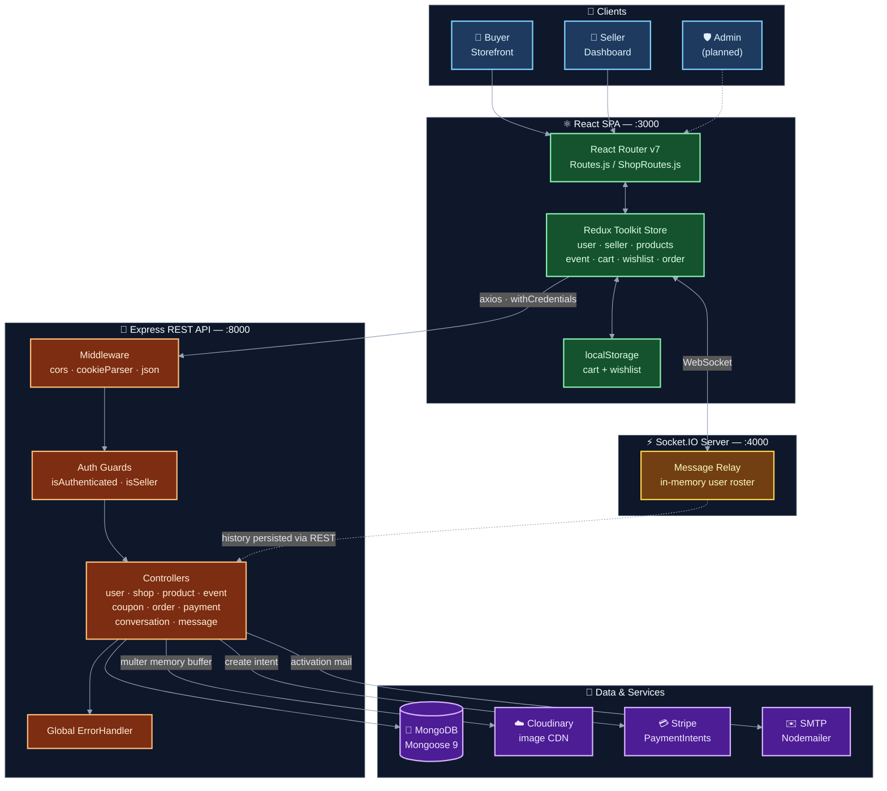

---

## ✨ Key Features

### 👥 Multi-Role User System

Three roles, two of them fully implemented as **independent authentication identities** — not as a `role` flag on one account. A single browser can be logged in as a buyer and a seller simultaneously without the sessions colliding.

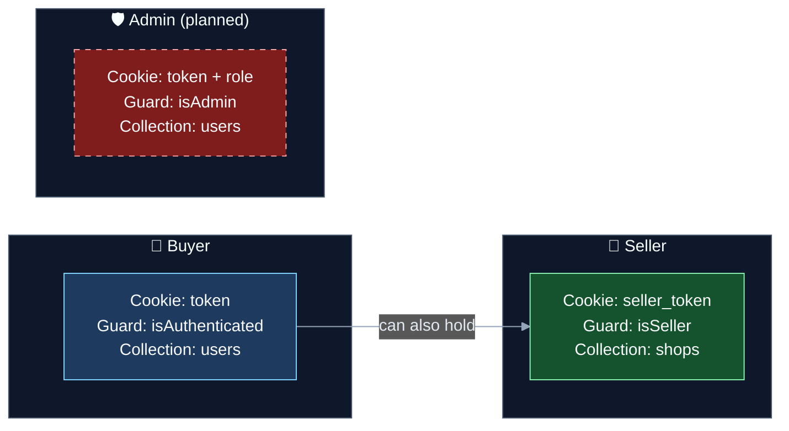

#### 🛒 Buyer

- **Email-activation signup** — registration does not create an account; it emails a signed JWT activation link. `POST /user/activation` exchanges the token for the real record.
- Browse the full catalog, best-selling rankings, flash events, category pages, and individual shop storefronts.
- Product detail pages with image galleries, star ratings, and written reviews.
- **Cart and wishlist persisted to `localStorage`** through Redux — a refresh mid-checkout does not empty the cart.
- Multiple saved shipping addresses with country/state/city pickers (`country-state-city`).
- Coupon codes applied at checkout against a seller's own coupon rules.
- Stripe card payments, PayPal scaffolding, and cash on delivery.
- Order history, a visual order-tracking timeline, and refund requests.
- Live chat with any seller.

#### 🏪 Seller

- Separate shop registration → activation email → seller login, issuing its own `seller_token` cookie.
- Dashboard with available balance, order counts, and product totals.
- Create and delete products and time-boxed events with multi-image upload.
- Create and manage discount coupon codes scoped to the shop.
- Order management: advance fulfillment status, approve refunds.
- Withdraw available balance to a saved withdraw method.
- Shop settings (avatar, description, address) and a public shop preview page.
- Live inbox for customer conversations.

#### 🛡️ Admin *(designed, not yet wired)*

The schema and client-side plumbing anticipate an admin tier — `User.role` exists, `getAllOrdersOfAdmin` is implemented in the Redux layer, and `order.js` already imports an `isAdmin` guard. **The server side is not built yet:** `isAdmin` is not exported from `middleware/auth.js`, and no `/order/admin-all-orders` route exists. The [Admin Flow](#-admin-flow) below documents the intended design; see [Known Gaps](#-known-gaps--roadmap) for what remains.

---

### 📦 Product Management & Shopping

#### Product listings

Sellers create products through a multipart form. Images never touch the app server's disk:

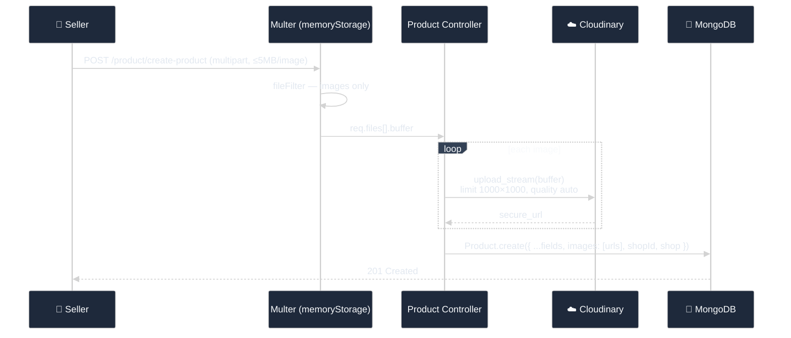

Each product carries a denormalized `shop` object alongside `shopId`, so listing pages render seller name and avatar without a second query or a `populate()`.

**Deletion is transactional in spirit:** `deleteImagesByUrl()` reverses each stored `secure_url` back into a Cloudinary `public_id` and removes the asset — but it never throws. An orphaned image on the CDN is not a good reason to fail a delete the seller explicitly asked for.

#### Cart & checkout

The cart lives entirely on the client (Redux + `localStorage`) until the moment of order creation. The server never holds a cart — which means no cart-abandonment cleanup job, no session store, and no server state to lose.

At checkout, the mixed cart is **split by shop**:

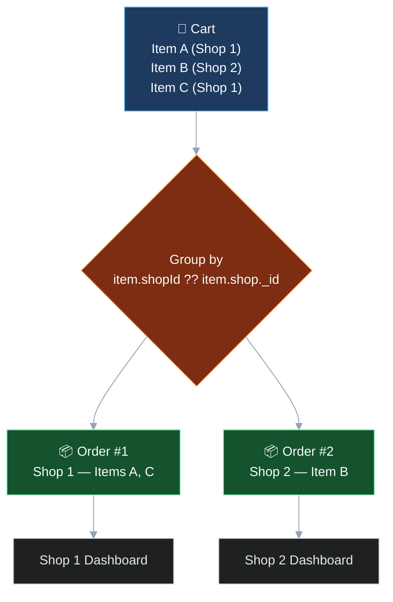

The grouping key falls back across two shapes — `item.shopId || item.shop?._id?.toString()` — because cart items arriving from different UI surfaces historically carried the shop reference differently. One buyer transaction becomes *N* independently fulfillable orders.

#### Search & filtering

Search is **client-side and instant**. `Header.jsx` filters the already-loaded `allProducts` slice on every keystroke and renders a live dropdown — no network round trip, no debounce needed, results appear as fast as the user types.

Category, best-selling, and best-deals views are also derived from the same Redux slice. One important rule enforced across all of them: **ranked views sort a copy, never the store.** `Array.prototype.sort()` mutates in place, and sorting `allProducts` directly would silently reorder global state for every other component.

> **Trade-off, stated plainly:** this is fast and simple at current catalog size, but it ships the entire catalog to the browser. Server-side search and pagination are on the roadmap for when the catalog outgrows a single payload.

---

### 💳 Payment Processing

#### Multiple payment gateways

| Method | Flow | Status |
|---|---|---|
| **Stripe (card)** | Server creates a PaymentIntent → client confirms the card → order written with `paymentInfo` | ✅ Implemented |
| **Cash on Delivery** | Skips the gateway entirely; order written with COD payment info | ✅ Implemented |
| **PayPal** | `createOrder` / `paypalPaymentHandler` present in `Payment.jsx`, SDK import commented out | 🟡 Scaffolded |

#### Secure transactions

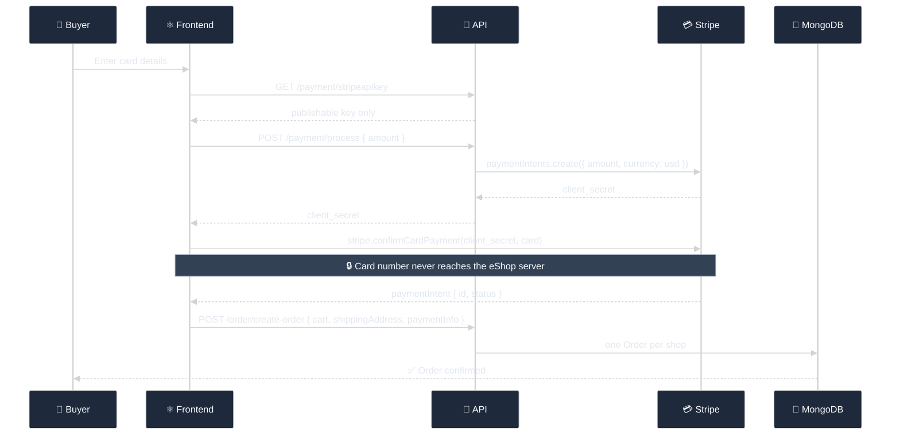

The security property that matters: **raw card data never transits the application server.** The backend holds only the secret key and produces a `client_secret`; the card itself goes from the browser directly to Stripe. Only the publishable key is ever sent to the client, via a dedicated endpoint.

---

### 💬 Real-Time Messaging

#### Buyer ↔ Seller chat

A dedicated Socket.IO server maintains an in-memory roster and relays messages point-to-point.

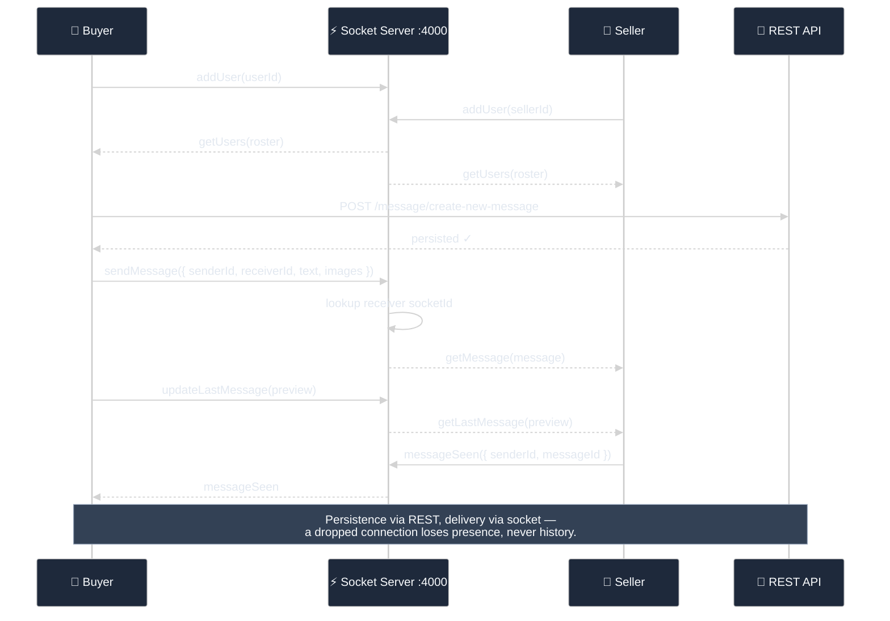

| Event | Direction | Payload |
|---|---|---|
| `addUser` | client → server | `userId` — registers the socket |
| `getUsers` | server → all | Online roster |
| `sendMessage` | client → server | `{ senderId, receiverId, text, images }` |
| `getMessage` | server → receiver | The relayed message |
| `messageSeen` | client → server | `{ senderId, receiverId, messageId }` |
| `updateLastMessage` | client → server | Thread preview text |
| `getLastMessage` | server → receiver | Updated preview |
| `disconnect` | — | Removes the socket from the roster |

Consumed by `pages/UserInbox.jsx` (buyer) and `components/Shop/DashboardMessages.jsx` (seller), both connecting over the `websocket` transport.

#### Notifications

In-app feedback runs through **react-toastify** — order placement, refund requests, status changes, validation failures, and auth errors all surface as non-blocking toasts rather than alerts or silent failures. Email notification is handled separately by Nodemailer for account and shop activation. Browser push notifications are not implemented.

---

### 📊 Seller Dashboard Features

```mermaid
%%{init: {'theme':'dark','themeVariables':{'fontSize':'15px','textColor':'#e2e8f0','primaryTextColor':'#f8fafc','lineColor':'#94a3b8','clusterBkg':'#0f172a','clusterBorder':'#475569','noteBkgColor':'#334155','noteTextColor':'#f8fafc','noteBorderColor':'#94a3b8','actorBkg':'#1e293b','actorTextColor':'#f8fafc','signalTextColor':'#e2e8f0','labelBoxBkgColor':'#334155','labelTextColor':'#f8fafc','loopTextColor':'#f8fafc'}}}%%
graph TD
    D["🏪 Seller Dashboard"]
    D --> S1["💰 Sales Tracking"]
    D --> S2["📦 Order Management"]
    D --> S3["📈 Analytics"]
    D --> S4["⚙️ Catalog & Settings"]

    S1 --> S1a["Available balance"]
    S1 --> S1b["10% platform service charge<br/>deducted on delivery"]
    S1 --> S1c["Withdraw to saved method"]

    S2 --> S2a["All orders (MUI DataGrid)"]
    S2 --> S2b["Status pipeline"]
    S2 --> S2c["Refund queue"]

    S3 --> S3a["Total orders"]
    S3 --> S3b["Product count"]
    S3 --> S3c["Latest orders table"]

    S4 --> S4a["Products & events"]
    S4 --> S4b["Coupon codes"]
    S4 --> S4c["Shop profile & preview"]

    style D fill:#14532d,stroke:#86efac,stroke-width:3px,color:#f8fafc
    style S1 fill:#7c2d12,stroke:#fdba74,color:#f8fafc
    style S2 fill:#1e3a5f,stroke:#7dd3fc,color:#f8fafc
    style S3 fill:#4c1d95,stroke:#d8b4fe,color:#f8fafc
    style S4 fill:#713f12,stroke:#fcd34d,color:#f8fafc
```

#### Sales tracking

Earnings are credited **on delivery, not on payment.** When a seller marks an order `Delivered`, the controller computes a **10% platform service charge** and credits `totalPrice − serviceCharge` to the shop's `availableBalance`, stamping `paymentInfo.status = "Succeeded"` and `deliveredAt`. Delaying the credit until delivery is what makes refunds tractable — money that was never released does not have to be clawed back.

#### Order management

Fulfillment moves forward-only through a fixed pipeline. The UI enforces this by `slice()`-ing the status array at the current status, so a seller can only ever select a state at or ahead of the current one — no accidental regressions.


Stock is decremented when the order is **transferred to the delivery partner** (not at checkout — an order that never ships should not consume inventory) and restored on `Refund Success`.

#### Analytics

The dashboard hero surfaces available balance, all-orders count, and product count, with a latest-orders DataGrid beneath. Metrics are currently **derived client-side** from the already-fetched orders and products slices rather than from dedicated aggregation endpoints — accurate and zero-extra-query at current volume, and the natural first thing to move server-side as order counts grow.

---

## 🔌 API Architecture

**Base URL:** `http://localhost:8000/api/v2`

The API is organized as **one router per resource**, each mounted in `app.js`. Every handler is wrapped in `catchAsyncErrors` and every failure exits through the single global error middleware.

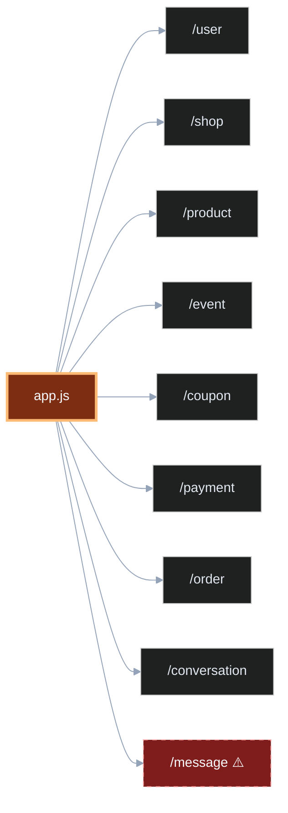

> ⚠️ **Currently mis-wired.** `app.js` mounts `model/conversation.js` (a Mongoose model) at `/api/v2/conversation` instead of `controller/conversation.js`, and `controller/message.js` is never mounted at all. The routes below are implemented in the controllers but unreachable until the mounting is corrected. See [Known Gaps](#-known-gaps--roadmap).

### Request lifecycle

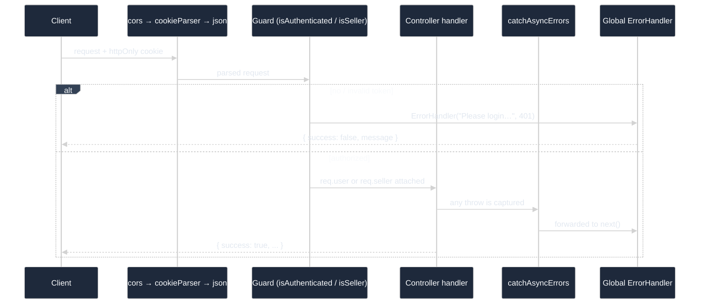

### `/user`
| Method | Endpoint | Auth | Description |
|---|---|---|---|
| POST | `/create-user` | — | Register; sends activation email |
| POST | `/activation` | — | Activate account from token |
| POST | `/login-user` | — | Login; sets `token` cookie |
| GET | `/get-user` | user | Current user |
| GET | `/logout` | user | Clear cookie |
| PUT | `/update-user-info` | user | Name / email / phone |
| PUT | `/update-avatar` | user | Upload avatar |
| PUT | `/update-user-addresses` | user | Add or edit address |
| DELETE | `/delete-user-address/:id` | user | Remove address |
| PUT | `/update-user-password` | user | Change password |
| GET | `/user-info/:id` | — | Public user info (for chat) |

### `/shop`
| Method | Endpoint | Auth | Description |
|---|---|---|---|
| POST | `/create-shop` | — | Register shop; sends activation email |
| POST | `/activation` | — | Activate shop |
| POST | `/login-shop` | — | Seller login; sets `seller_token` |
| GET | `/get-seller` | seller | Current shop |
| GET | `/logout` | seller | Clear seller cookie |
| GET | `/get-shop-info/:id` | — | Public shop profile |
| PUT | `/update-seller-info` | seller | Shop settings |

### `/product`
| Method | Endpoint | Auth | Description |
|---|---|---|---|
| POST | `/create-product` | seller | Create with images |
| GET | `/get-all-products` | — | Full catalog |
| GET | `/get-all-products-shop/:shopId` | — | One shop's products |
| DELETE | `/delete-shop-product/:id` | seller | Delete + Cloudinary cleanup |
| PUT | `/create-new-review` | user | Review + recompute average rating |

### `/event`
| Method | Endpoint | Auth | Description |
|---|---|---|---|
| POST | `/create-event` | seller | Create timed event |
| GET | `/get-all-events` | — | All events |
| GET | `/get-all-events/:id` | — | One shop's events |
| DELETE | `/delete-shop-event/:id` | seller | Delete |

### `/coupon`
| Method | Endpoint | Auth | Description |
|---|---|---|---|
| POST | `/create-coupon-code` | seller | Create coupon |
| GET | `/get-coupon/:id` | seller | Shop's coupons |
| DELETE | `/delete-coupon/:id` | seller | Delete |
| GET | `/get-coupon-value/:name` | — | Look up at checkout |

### `/order`
| Method | Endpoint | Auth | Description |
|---|---|---|---|
| POST | `/create-order` | — | Split cart into per-shop orders |
| GET | `/get-all-orders/:userId` | — | Buyer's orders |
| GET | `/get-seller-all-orders/:shopId` | — | Shop's orders |
| PUT | `/update-order-status/:id` | seller | Advance fulfillment; credit balance on delivery |
| PUT | `/order-refund/:id` | user | Request refund |
| PUT | `/order-refund-success/:id` | seller | Approve refund; restore stock |

### `/payment`
| Method | Endpoint | Description |
|---|---|---|
| POST | `/process` | Create a Stripe PaymentIntent |
| GET | `/stripeapikey` | Publishable key for the client |

### `/conversation` & `/message`
| Method | Endpoint | Description |
|---|---|---|
| POST | `/conversation/create-new-conversation` | Start or reuse a thread |
| GET | `/conversation/get-all-conversation-seller/:id` | Seller inbox |
| GET | `/conversation/get-all-conversation-user/:id` | Buyer inbox |
| PUT | `/conversation/update-last-message/:id` | Update thread preview |
| POST | `/message/create-new-message` | Persist a message |
| GET | `/message/get-all-messages/:id` | Thread history |

---

## 💎 Brand Value Propositions

### 🚀 Scalability

| Property | Implementation |
|---|---|
| **Service separation** | Storefront, API, and socket server deploy and scale independently — chat load never competes with checkout |
| **Stateless real-time tier** | The socket server holds only a volatile roster; restarting it loses presence, not data |
| **Stateless API** | Auth is a self-contained JWT in a cookie — no server session store, so API instances scale horizontally behind a load balancer |
| **Offloaded media** | Images live on Cloudinary's CDN, not on the app server — no shared filesystem to coordinate between instances |
| **Connection pooling** | Mongoose configured with `maxPoolSize: 10` and explicit server-selection/socket timeouts |
| **Strategic denormalization** | Orders embed cart snapshots and products embed a `shop` object, eliminating joins on read-heavy paths |

### 🔐 Security

| Property | Implementation |
|---|---|
| **HTTP-only cookies** | JWTs are unreadable by client JavaScript — an XSS payload cannot exfiltrate a session |
| **Role isolation** | Two separate tokens and guards; a `seller_token` cannot satisfy `isAuthenticated`, and vice versa |
| **Password hashing** | bcrypt on save, with `select: false` so passwords never leave the DB layer by accident |
| **Email-verified signup** | Registration produces a signed, expiring activation JWT — no account exists until the address is proven |
| **PCI surface reduction** | Card data goes browser → Stripe directly; the server sees only a `client_secret` and a payment ID |
| **Secret hygiene** | `config/.env` is gitignored (and was purged from tracking in commit `0066965`); only the publishable Stripe key reaches the client |
| **Upload validation** | Multer enforces a 5MB cap and an `image/*` MIME filter before any byte reaches Cloudinary |
| **Explicit CORS** | Origin pinned to the known frontend with `credentials: true` — no wildcard with cookies |

### ⚡ Performance

| Property | Implementation |
|---|---|
| **Instant search** | Client-side filtering over the loaded catalog — no network round trip per keystroke |
| **CDN-delivered images** | Cloudinary serves images resized to ≤1000×1000 with `quality: auto` |
| **Zero-latency cart** | Cart and wishlist read/write `localStorage` synchronously; no server call until checkout |
| **Denormalized reads** | Product cards render seller identity with no second query and no `populate()` |
| **In-memory upload path** | Files stream buffer → Cloudinary; no disk write, no cleanup job |
| **DB-first startup** | The port opens only after MongoDB is connected, eliminating a whole class of cold-start timeouts |

---

## 🧰 Tech Stack

### Backend

| Tool | Version | Purpose |
|---|---|---|
| Node.js + Express | 5.x | REST API and routing |
| MongoDB + Mongoose | 9.x | Database and ODM |
| jsonwebtoken | 9.x | Auth cookies + activation tokens |
| bcrypt / bcryptjs | 6.x / 3.x | Password hashing |
| cookie-parser | 1.4 | Reads `token` / `seller_token` |
| cors | 2.8 | Credentialed cross-origin access |
| body-parser | 2.x | URL-encoded bodies (50mb limit) |
| dotenv | 17.x | Config from `config/.env` |
| nodemon | 3.x | Dev reload |

### Frontend

| Tool | Version | Purpose |
|---|---|---|
| React | 19.x (CRA) | UI |
| Redux Toolkit + react-redux | 2.x / 9.x | Global state — 7 slices |
| React Router | 7.x | Routing via `Routes.js` / `ShopRoutes.js` |
| Tailwind CSS | 3.4 | Styling + shared `styles/styles.js` tokens |
| MUI + MUI X DataGrid | 9.x | Dashboard tables |
| Axios | 1.x | HTTP with `withCredentials: true` |
| react-toastify | 11.x | Non-blocking notifications |
| react-icons / react-lottie / timeago.js | — | Icons, animations, relative timestamps |
| country-state-city | 3.x | Address pickers |

### File & Media Handling

| Tool | Purpose |
|---|---|
| **Multer** (`memoryStorage`) | Upload gate — 5MB cap, `image/*` filter, buffer only |
| **Cloudinary** v2 | Storage + CDN; lazy `ensureConfigured()` with an explicit missing-key error, `upload_stream` from buffer, `publicIdFromUrl()` reversal for deletes, best-effort `deleteImagesByUrl()` cleanup |

### Real-Time Communication

| Tool | Purpose |
|---|---|
| **Socket.IO** 4.x (server + client) | Standalone relay on port 4000, CORS-pinned to the frontend, `websocket` transport |
| **Push notifications** | ❌ Not implemented — in-app toasts and transactional email cover notification today |

### Development & Deployment Tools

| Area | Current state |
|---|---|
| **Version control** | Git / GitHub |
| **Dev servers** | `nodemon` (API), `react-scripts start` (frontend), `nodemon` (socket) |
| **Env management** | `dotenv` + gitignored `backend/config/.env` |
| **CI/CD** | ❌ Not configured — no `.github/workflows` present |
| **Containerization** | ❌ Not configured — no `Dockerfile` or `docker-compose.yml` present |
| **Testing** | ❌ No test suite; `npm test` is a placeholder |

> **Intended deployment topology** (not yet implemented): three containers — `frontend` (static build behind nginx), `api`, and `socket` — composed with MongoDB, fronted by a reverse proxy, with a GitHub Actions pipeline running install → lint → build → deploy per service. The blocking prerequisite is replacing the hardcoded `localhost` URLs in `frontend/src/server.js`, `app.js` CORS, and `socket/index.js` CORS with environment-driven values. This is tracked in the [Roadmap](#-known-gaps--roadmap).

---

## 🧩 Challenges & Solutions

| # | Challenge | Root cause | Solution |
|---|---|---|---|
| 1 | **Mongoose "buffering timed out" on cold starts** | `app.listen()` ran before the DB connection resolved; requests arriving in that window hit Mongoose's buffer and expired before Atlas woke up | `server.js` now `await`s `connectDatabase()` and only then opens the port. If the DB fails after 5 retries, the process exits rather than serving broken requests |
| 2 | **Buyer and seller sessions colliding** | A single `token` cookie cannot represent two identities in one browser | Two independent cookies (`token`, `seller_token`) verified by two separate middlewares against two collections — a seller can shop from the same browser |
| 3 | **Cloudinary "Must supply api_key"** | The SDK auto-configures only from a single `CLOUDINARY_URL`, but credentials are stored as three separate keys — and the module was required before dotenv ran | Lazy `ensureConfigured()` on first use, with an explicit error naming exactly which keys are missing |
| 4 | **`upload_stream` failing with an opaque error** | Multer was on `diskStorage`, so `req.file.buffer` was `undefined` | Switched to `memoryStorage` and added an explicit `Buffer.isBuffer()` guard that says *why* it failed |
| 5 | **Static mock data leaking into live pages** | `static/data.jsx` fixtures used pre-API field names (`id`, `image_Url`, `discount_price`, `total_sell`) vs the real shape (`_id`, `images`, `discountPrice`, `sold_out`) — cards rendered blank and links resolved to `/product/undefined` | Every product surface now reads `state.products.allProducts`; `static/data.jsx` is reserved for nav/category constants only |
| 6 | **Sorting mutated global state** | `Array.prototype.sort()` sorts in place, so ranking `allProducts` directly reordered the Redux store for every consumer | Every ranked view (best-selling, best deals) sorts a copy |
| 7 | **Cart emptying on refresh** | Redux state is memory-only | Cart and wishlist slices mirror to `localStorage` on every mutation and rehydrate at store creation |
| 8 | **Cart items carrying inconsistent shop references** | Different UI surfaces attached the shop as `shopId` or as a nested `shop._id` | Order splitting resolves both: `item.shopId \|\| item.shop?._id?.toString()` |
| 9 | **Deleting a product orphaning CDN images** | Cloudinary needs a `public_id`, but only `secure_url` was stored | `publicIdFromUrl()` reverses the URL (stripping version segment and extension) and returns `null` for legacy non-Cloudinary filenames, so old records degrade gracefully |
| 10 | **Sellers regressing an order's status** | A free-choice status dropdown allowed moving backwards | The UI `slice()`s the status array at the current status, making the pipeline forward-only |
| 11 | **Refunding money already paid out** | Crediting sellers at payment time makes refunds a clawback problem | Balance is credited only when the order reaches `Delivered` — money not yet released never needs recovering |

---

## 🗄 Database Design

MongoDB, 8 collections. The schema deliberately favors **embedding and denormalization over references** — cart snapshots inside orders, shop objects inside products, review arrays inside products — because the read patterns are catalog-heavy and orders must preserve what was true at purchase time, not what is true now.

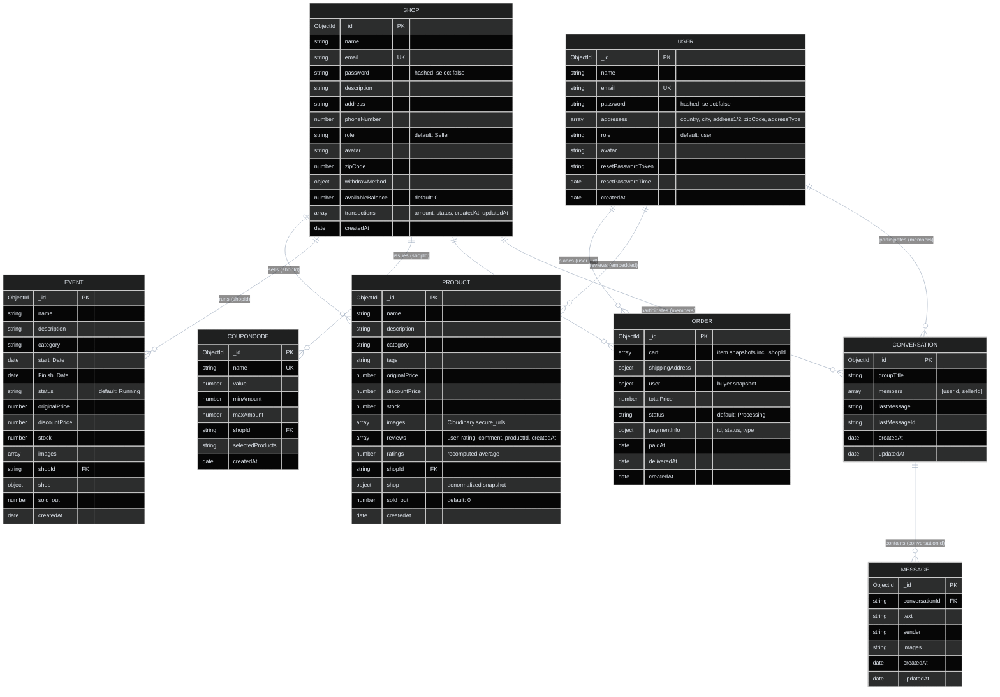

### Design notes

- **`ORDER.cart` is a snapshot, not a reference.** If a seller later edits a product's price or deletes it entirely, historical orders remain accurate. This is the correct trade for financial records.
- **`PRODUCT.shop` duplicates the shop document.** Listing pages need seller name and avatar on every card; embedding removes a query from the hottest read path. The cost is staleness after a shop renames — acceptable, and the tradeoff is made knowingly.
- **Relationships are string `shopId` fields, not `ObjectId` refs.** There is no `populate()` anywhere in the codebase; queries reach into embedded documents with dotted paths like `Order.find({ "cart.shopId": shopId })` and `Order.find({ "user._id": userId })`.
- **`reviews` are embedded in `PRODUCT`** and the `ratings` average is recomputed on each new review, so the sort key for rating-based views needs no aggregation.
- **`CONVERSATION.members` is a plain array** holding both the buyer id and the seller id — the same shape regardless of which side started the thread.

---

## 🔄 Application Flow Diagram

The end-to-end path from browsing to a fulfilled, paid-out order:

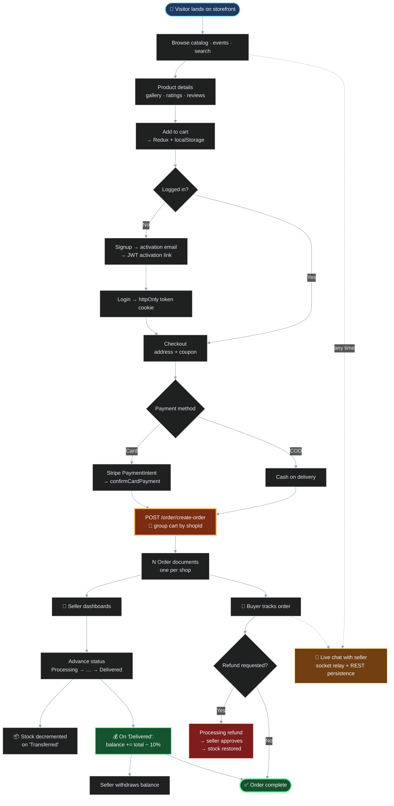

---

## 🛒 User Flow


---

## 🏪 Seller Flow


---

## 🛡️ Admin Flow

> **Status: designed, not yet implemented.** `User.role` exists in the schema, `getAllOrdersOfAdmin` is written in `redux/actions/order.js`, and `controller/order.js` already imports an `isAdmin` guard — but `isAdmin` is not exported from `middleware/auth.js` and no admin routes are registered. The sequence below is the intended design and the target for the next milestone.


**Prerequisites to ship this tier:** export an `isAdmin` middleware, register the admin routes, add a `Withdraw` model and its request lifecycle, and build the admin route tree in the SPA.

---

## ✅ Best Practices

### 🔐 Authentication & Security

#### JWT

Authentication is **stateless JWT delivered in HTTP-only cookies** — not OAuth, and not bearer tokens in `localStorage`. Two token families exist:

| Token | Cookie | Guard | Signed with | Purpose |
|---|---|---|---|---|
| User session | `token` | `isAuthenticated` | `JWT_SECRET` | Buyer identity |
| Seller session | `seller_token` | `isSeller` | `JWT_SECRET` | Shop identity |
| Activation | *(in the email URL)* | — | `ACTIVATION_SECRET` | One-shot, short-lived account/shop creation |

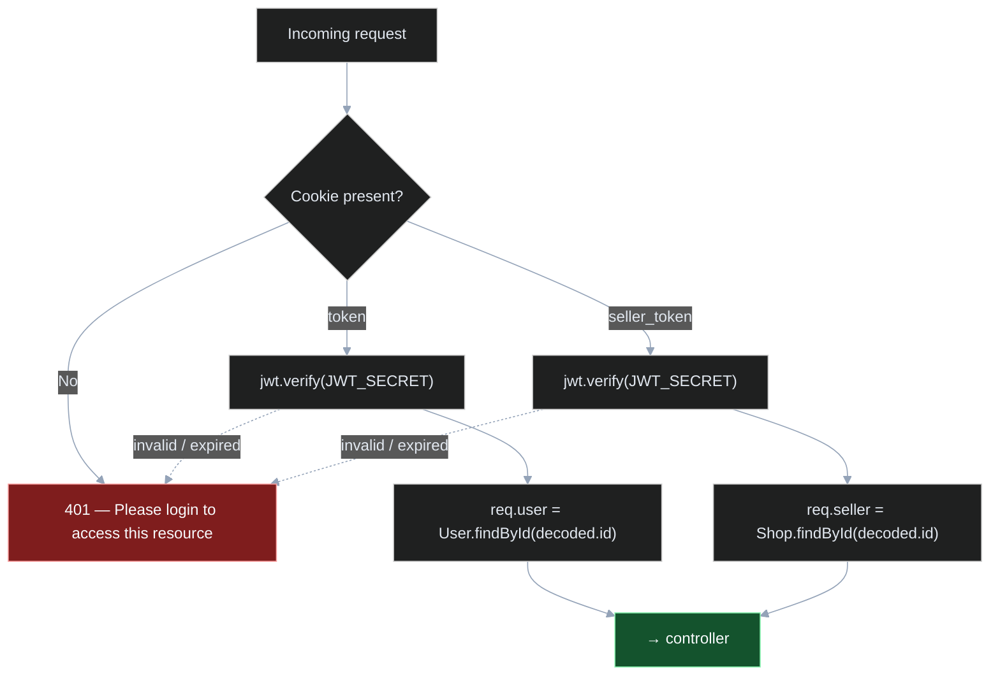

Why cookies over `localStorage`: an `httpOnly` cookie is invisible to `document.cookie`, so an injected script cannot read or forward the session token. The cost — CSRF exposure — is mitigated by the pinned CORS origin, and adding SameSite/CSRF tokens is on the roadmap.

> **OAuth / social login is not implemented.** Email-and-password with mandatory email activation is the only identity path today.

#### Data encryption

| Data | Protection |
|---|---|
| Passwords | bcrypt hash on save; `select: false` keeps them out of every default query |
| Session tokens | Signed JWTs in `httpOnly` cookies |
| Activation tokens | Signed with a separate `ACTIVATION_SECRET`, short expiry, single use |
| Card data | Never stored, never transmitted through the API — Stripe holds it |
| Secrets at rest | `backend/config/.env`, gitignored and purged from history |
| Media in transit | Cloudinary configured with `secure: true` (HTTPS URLs only) |

### 🧩 Component Architecture

#### Reusable components

The frontend is organized by **domain, not by file type**, so a feature lives in one place:

```
frontend/src/
├── components/
│   ├── Layout/          # Header, Footer, Loader, Navbar, DropDown
│   ├── Route/           # Hero, Categories, BestDeals, FeaturedProduct, ProductCard
│   ├── Products/        # ProductDetails, Ratings, SuggestedProduct
│   ├── Shop/            # DashboardHero, DashboardSideBar, OrderDetails,
│   │                    #   AllProducts, AllOrders, AllRefundOrders,
│   │                    #   CreateProduct, CreateEvent, WithdrawMoney,
│   │                    #   ShopSettings, DashboardMessages
│   ├── Profile/         # ProfileContent, ProfileSideBar, TrackOrder
│   ├── Checkout/        # Checkout, CheckoutSteps
│   ├── Payment/         # Payment (Stripe / PayPal / COD)
│   ├── cart/            # Cart drawer
│   └── Wishlist/        # Wishlist drawer
├── pages/               # Buyer pages + pages/Shop/ seller pages
├── redux/               # actions/ · reducers/ · store.js
├── static/data.jsx      # Nav & category constants only
├── styles/styles.js     # Shared Tailwind class tokens
├── server.js            # export const server = ".../api/v2"
├── Routes.js            # Buyer route barrel
└── ShopRoutes.js        # Seller route barrel
```

Three conventions hold this together:

1. **Barrel route files.** `Routes.js` and `ShopRoutes.js` re-export every page, so `App.jsx` imports from two modules instead of thirty — and adding a page is a one-line change in one predictable place.
2. **Shared style tokens.** `styles/styles.js` exports named Tailwind class strings (`styles.button`, `styles.section`, `styles.productTitle`) so visual changes propagate from a single file rather than requiring a codebase-wide find-and-replace.
3. **Pages compose, components render.** `pages/` handle routing, guards, and data dispatch; `components/` receive props and render. `ProductCard` is used identically by the home page, the category page, the best-selling page, and the shop preview.

#### Modular structure — backend

```
backend/
├── controller/          # One Express router per resource
├── model/               # One Mongoose schema per collection
├── middleware/
│   ├── auth.js          # isAuthenticated · isSeller
│   ├── catchAsyncErrors.js
│   └── error.js         # Global error handler
├── utils/               # ErrorHandler · jwtToken · sendMail · cloudinary
├── db/Database.js       # Connection with retry + reconnect listeners
├── config/.env          # gitignored
├── multer.js            # Upload gate
├── app.js               # Express app + route mounting
└── server.js            # DB-first startup
```

Every layer has one job. Adding a resource means: one model, one controller, one `app.use` line.

### 🚨 Error Handling & User Experience

#### The error pipeline

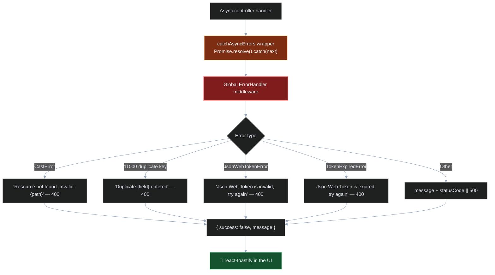

**Every async handler is wrapped.** `catchAsyncErrors` means no controller needs its own try/catch to stay safe, and no rejected promise can crash the process unhandled.

#### Friendly error messages

Raw database errors are translated into language a user can act on. A `CastError` becomes *"Resource not found"* rather than a Mongoose stack trace; a duplicate-key violation names the field that collided instead of leaking an index name. On the client, every failure surfaces as a **react-toastify** toast — non-blocking, dismissible, and never a browser `alert()`.

Errors from operations that *shouldn't* block the user are swallowed deliberately: `deleteImagesByUrl()` logs a Cloudinary failure and continues, because a leftover CDN asset must not fail the deletion the seller requested.

Some errors are made friendly at the *source*, before they can propagate:

- `ensureConfigured()` throws `"Cloudinary is not configured — missing CLOUDINARY_API_KEY in backend/config/.env"` instead of the SDK's opaque `"Must supply api_key"`.
- `uploadToCloudinary()` throws `"expected a file buffer — check that multer is using memoryStorage"` instead of failing deep inside a stream.

#### Logging & monitoring

| Signal | Handling |
|---|---|
| `uncaughtException` | Logged, then `process.exit(1)` — registered first, before any other code runs |
| `unhandledRejection` | Logged, server closed gracefully, then exit |
| DB connection failure | Retried 5× at 5s intervals with attempt-numbered logs; exits if exhausted |
| DB disconnect / reconnect | `mongoose.connection` event listeners log and auto-reconnect |
| Startup | Explicit `✅ Database connected` / `🚀 Server running on Port` / `❌ Database connection failed — server will NOT start` |
| Health check | `GET /test` returns `{ success: true, message: "Server is working fine" }` |

**Fail fast, fail loud.** A server that cannot reach its database does not start at all — serving 500s from a half-alive process is worse than being visibly down.

> External APM (Sentry, Datadog) and structured request logging (morgan/winston) are not wired up; console logging is the current observability layer.

---

## 🚀 Getting Started

### Prerequisites

- Node.js 18+
- MongoDB (local or Atlas)
- A Cloudinary account
- A Stripe account (test keys are fine)
- An SMTP mailbox (a Gmail app password works)

### 1. Clone

```bash
git clone https://github.com/5arimNadeem/E-Shop-MultiVendor.git
cd E-Shop-MultiVendor
```

### 2. Backend — port 8000

```bash
cd backend
npm install
# create config/.env — see below
npm run dev
```

### 3. Socket server — port 4000

```bash
cd socket
npm install
npm run dev
```

### 4. Frontend — port 3000

```bash
cd frontend
npm install
npm start
```

All three must run together. The API's CORS origin and the socket server's CORS origin are both pinned to `http://localhost:3000`.

### Environment variables

Create `backend/config/.env`:

```env
PORT=8000
DB_URL=mongodb://localhost:27017/eshop

JWT_SECRET=your_jwt_secret
JWT_EXPIRES=7d
ACTIVATION_SECRET=your_activation_secret

SMPT_HOST=smtp.gmail.com
SMPT_PORT=465
SMPT_MAIL=you@gmail.com
SMPT_PASSWORD=your_app_password

STRIPE_API_KEY=pk_test_xxx
STRIPE_SECRET_KEY=sk_test_xxx

CLOUDINARY_NAME=your_cloud_name
CLOUDINARY_API_KEY=xxx
CLOUDINARY_API_SECRET=xxx
```

> `backend/config/.env` is gitignored. The `SMPT_` spelling is intentional — it matches the keys read in `utils/sendMail.js`.

Optionally add `socket/.env` with `PORT=4000` (defaults to 4000 if absent).

The frontend reads its API base from `frontend/src/server.js`, not from an env file:

```js
export const server = "http://localhost:8000/api/v2";
export const backendUrl = "http://localhost:8000/";
```

---

## 🚧 Known Gaps & Roadmap

Stated plainly, because a case study that only lists wins isn't one.

### Bugs to fix

- [ ] **Chat REST routes are unreachable.** `app.js` mounts `model/conversation.js` (a Mongoose model) at `/api/v2/conversation` instead of `controller/conversation.js`, and `controller/message.js` is never mounted. Both controllers are written and correct — only the two mounting lines are wrong.
- [ ] **`isAdmin` is imported but does not exist.** `controller/order.js` destructures `isAdmin` from `middleware/auth.js`, which never exports it. Currently harmless (no route uses it), but it will throw the moment one does.
- [ ] **`getAllOrdersOfAdmin` calls a route that isn't there.** The Redux action requests `/order/admin-all-orders`; no such endpoint is registered.

### Features to build

- [ ] Admin panel — platform-wide users, shops, orders, and withdraw approvals
- [ ] `Withdraw` model and the seller payout request lifecycle
- [ ] Forgot / reset password flow (`resetPasswordToken` and `resetPasswordTime` exist in the schema; the endpoints do not)
- [ ] Finish the PayPal integration (handlers exist; the SDK import is commented out)
- [ ] Server-side search and pagination for the catalog
- [ ] Push notifications

### Infrastructure

- [ ] Replace hardcoded `localhost` URLs with environment-driven config (`frontend/src/server.js`, `app.js` CORS, `socket/index.js` CORS) — **this blocks every deployment task below**
- [ ] Dockerfiles for the three services + `docker-compose.yml` with MongoDB
- [ ] GitHub Actions CI: install → lint → build → deploy
- [ ] Automated test suite (`npm test` is still the CRA placeholder on the frontend and an `exit 1` stub on the backend)
- [ ] Structured request logging and external error monitoring
- [ ] SameSite / CSRF hardening on the auth cookies
- [ ] Remove committed artifacts from the repo — `backend/uploads/`, `backend/tmp/`, and `node_modules` are currently tracked

---

## 🏁 Conclusion

eShop demonstrates that a multi-vendor marketplace is not a single-vendor store with a `shopId` column bolted on. The genuinely multi-tenant decisions — **splitting a mixed cart into per-shop orders**, **running two independent authentication identities in one browser**, **crediting seller balances only at delivery so refunds never become clawbacks**, and **detaching the real-time tier so chat load can never starve checkout** — are what separate the two, and each of them shaped the architecture rather than being retrofitted into it.

The engineering discipline shows most clearly in the failure paths: a server that refuses to open its port before the database answers, a Cloudinary helper that names the exact missing environment variable, an upload guard that explains *why* a buffer was absent, and a cleanup routine that deliberately swallows its own errors so it can never block the user's actual request. Those choices came from debugging real failures, and they are documented above alongside the bugs still open.

What remains is honest and scoped: the admin tier is designed but unwired, two route-mounting lines are wrong, and the hardcoded `localhost` URLs must become environment-driven before any of it can be containerized or shipped. Every one of those is tracked in the roadmap above.

---

## 👤 Author

**Sarim Nadeem** — [@5arimNadeem](https://github.com/5arimNadeem)

Structure and case-study format inspired by [hassaansaleem28/Multi-Vendor-Ecommerce-App](https://github.com/hassaansaleem28/Multi-Vendor-Ecommerce-App).

## 📄 License

ISC
